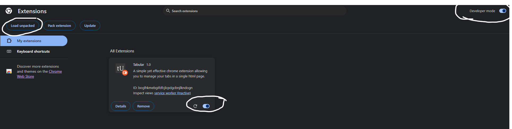

# Tabular - Excel-like tab management in Chrome
An alternative to Sideberry for Firefox, Tabular allows you to manage and save tabs in a productive fashion.

  
Save tabs at the click of a button ("View Saved Tabs" POV):
  
  

# Installation
1. Clone / Download this repo (i.e. `git clone https://github.com/Nquxii/tabular`)
2. Visit chrome://extensions
3. [Turn on developer mode in the top right corner of the screen](https://knowledge.workspace.google.com/kb/load-unpacked-extensions-000005962)
4. Click "load unpacked" and select the downloaded folder (ensure that its contents include subdirectories "images" and "src", otherwise it won't load)

